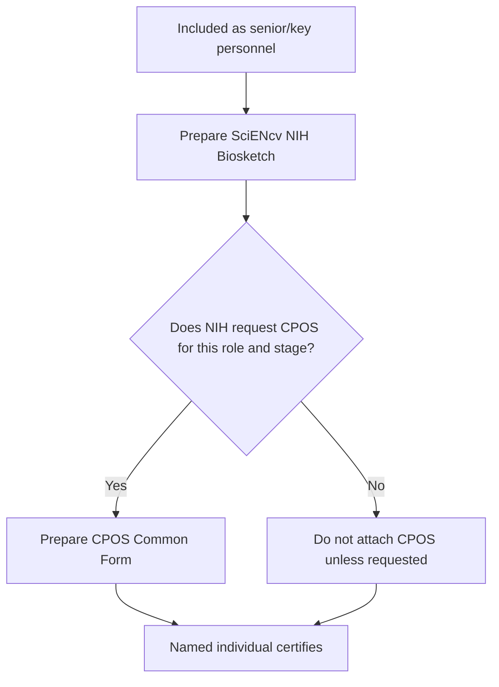

# Co-I / Key Personnel quickstart

If you are being included as **senior/key personnel**, you will generally need a SciENcv-generated **NIH Biosketch**. You will also need **CPOS / Other Support** when NIH requests it for your role and submission type.

{: .note }
> Two common exceptions to remember: **CPOS is not required for Other Significant Contributors (OSCs)**, and NIH says CPOS is **not specifically requested** for Program Directors, training faculty, and other oversight individuals in training grants.

## Quick steps

1. ORCID iD: create (if needed)
2. Link ORCID to **eRA Commons** (**required**) and confirm the same ORCID appears as the SciENcv **PID**
3. Ensure your **My Bibliography** is correct
4. Create the SciENcv documents (or work with your delegate)
5. **Certify + download PDFs**

Next: [Biosketch overview (what you’re producing)]({{ site.baseurl }})
