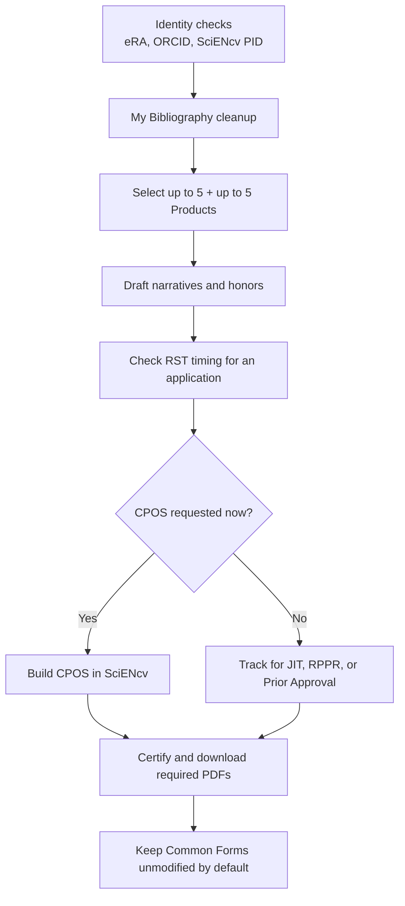

# PI / Faculty quickstart (15 minutes)

## Do this now (before the first deadline)

1. **Create ORCID iD** (if you don’t have one).
2. **Link ORCID to eRA Commons** (Personal Profile → ORCID section).
3. **Confirm SciENcv access** (MyNCBI dashboard → SciENcv).
4. **Confirm ORCID appears as the SciENcv PID** and matches eRA Commons (link ORCID in MyNCBI/SciENcv, sign in with ORCID, or manually enter it in the PID field).
5. **Add a delegate** (optional but recommended) (MyNCBI Account Settings → Delegates).
6. **Clean up My Bibliography** (missing papers, wrong authorship, PMCID status).
7. Select **up to 10 Products**:
   - Up to 5 **Products Most Closely Related to the Proposed Project**
   - Up to 5 **Other Significant Products**
8. Draft or update:
   - **Personal Statement** (3,500 characters)
   - **Up to 5 Contributions** (2,000 characters each)
   - **Honors** (up to 15)
   - In either narrative, use brief parenthetical references to selected Products when useful (lead author/year or PMID/PMCID); do not paste full citations or hyperlinks.
9. Confirm that your qualifying **Research Security Training** was completed within the 12 months before application submission.
10. **Certify + download each required PDF** in SciENcv (the biosketch when required; **CPOS only when NIH requests it** for your role and submission type).
11. Keep the certified SciENcv PDF **unmodified** unless the Application Guide or NOFO expressly requires a special compiled/flattened attachment.

{: .note }
> For many NIH applications, CPOS is requested later (often during **JIT**) rather than attached at initial submission. Important exception: **mentored career development** applications require CPOS for **mentor/co-mentor(s)**, not for the candidate.

{: .note }
> For an annual RPPR, the separate MFTRP statement in Section G.1 is an additional requirement for every senior/key person. It is not part of the SciENcv PDF. See [Research-security certifications]({{ site.baseurl }}).

## When an admin helps

Your delegate can do almost everything **except certification**. Plan a “certify window” into the submission timeline.

Next: [Create the biosketch document in SciENcv]({{ site.baseurl }})
