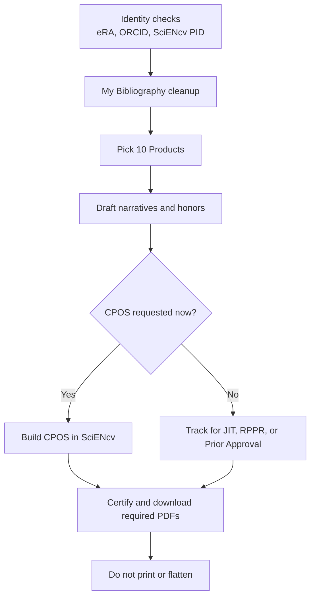

# PI / Faculty quickstart (15 minutes)

## Do this now (before the first deadline)

1. **Create ORCID iD** (if you don’t have one).
2. **Link ORCID to eRA Commons** (Personal Profile → ORCID section).
3. **Confirm SciENcv access** (MyNCBI dashboard → SciENcv).
4. **Confirm ORCID appears as the SciENcv PID** and matches eRA Commons (link ORCID in MyNCBI/SciENcv, sign in with ORCID, or manually enter it in the PID field).
5. **Add a delegate** (optional but recommended) (MyNCBI Account Settings → Delegates).
6. **Clean up My Bibliography** (missing papers, wrong authorship, PMCID status).
7. **Pick your 10 “Products”**:
   - 5 “Closely Related” (to support your Personal Statement)
   - 5 “Other Significant” (to support your Contributions)
8. Draft or update:
   - **Personal Statement** (3,500 characters; no citations)
   - **Up to 5 Contributions** (2,000 characters each; no citations)
   - **Honors** (up to 15)
9. **Certify + download required PDFs** in SciENcv (**always** the biosketch; **CPOS when NIH requests it** for your role and submission type).
10. **Never print/flatten** the SciENcv PDF.

{: .note }
> For many NIH applications, CPOS is requested later (often during **JIT**) rather than attached at initial submission. Important exception: **mentored career development** applications require CPOS for **mentor/co-mentor(s)**, not for the candidate.

## When an admin helps

Your delegate can do almost everything **except certification**. Plan a “certify window” into the submission timeline.

Next: [Create the biosketch document in SciENcv]({{ site.baseurl }})
