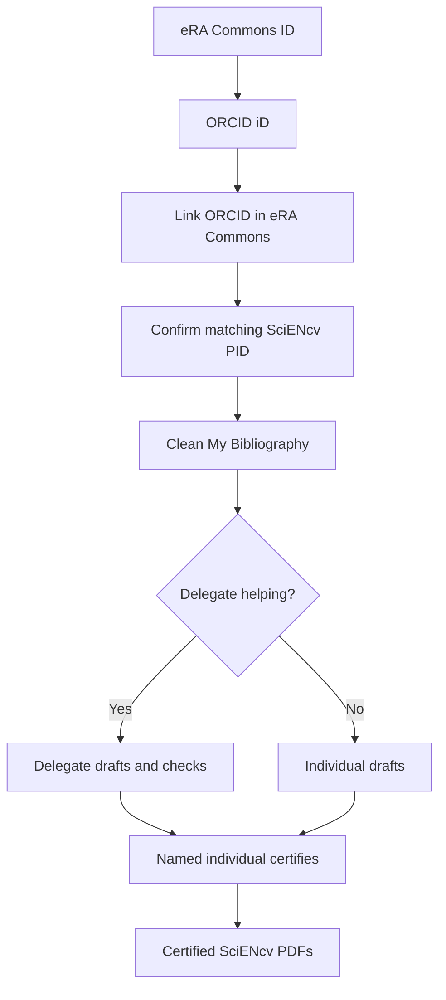

# Start Here

## Why this exists

NIH's biosketch and Current and Pending (Other) Support workflows use a **data-driven system** centered on SciENcv. Each required Common Form must be a **digitally certified PDF generated in SciENcv**.

## The “minimum viable compliance” path

1. Everyone who needs a biosketch gets:
   - **eRA Commons ID**
   - **ORCID iD**, linked to **eRA Commons** (**required**)
   - **MyNCBI/SciENcv** access working; ORCID appears as the SciENcv **PID** and matches eRA Commons
2. Publications are curated in **My Bibliography**
3. A delegate (admin) is assigned where helpful
4. PI logs in to **certify** the final PDFs

## Where to go next

- If you’re a PI: [PI / faculty quickstart]({{ site.baseurl }})
- If you’re a delegate/admin: [Administrator / delegate quickstart]({{ site.baseurl }})
- If you’re building department-wide support: [Submission planning & tracker]({{ site.baseurl }})
