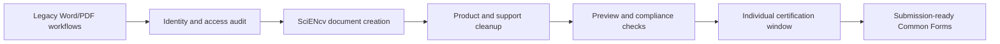

# Transition & implementation

Operational guidance for departments and grant teams transitioning from legacy NIH biosketch/other support processes to SciENcv-based Common Forms.

```mermaid
flowchart LR
    accTitle: Department transition path
    accDescr: Departments move from legacy documents to audited identity setup, SciENcv drafting, certification windows, and Common Forms submission.
    A["Legacy Word/PDF workflows"] --> B["Identity and access audit"]
    B --> C["SciENcv document creation"]
    C --> D["Product and support cleanup"]
    D --> E["Preview and compliance checks"]
    E --> F["Individual certification window"]
    F --> G["Submission-ready Common Forms"]
```
