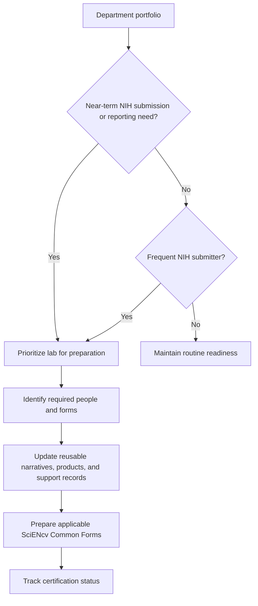

# Portfolio readiness (active awards + submissions)

Use a portfolio-level workflow to keep likely participants ready for upcoming applications, JIT requests, RPPRs, and Prior Approval submissions. Do not assume that every person or submission needs both forms; identify the required people and documents from the NOFO and applicable submission-stage instructions.

Tips:

- Start with the most active labs and frequent NIH submitters
- Prioritize people with near-term NIH submissions or reporting needs
- Keep reusable narratives, product lists, and support records current
- Standardize how you name SciENcv documents (`PI_LASTNAME_MECH_YYYYMMDD`)
- Track the named individual's review and certification separately for each required form

