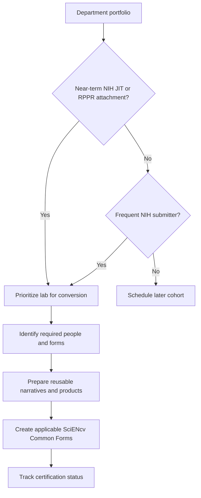

# Bulk migration (active awards + RPPR)

Even if an award started under the old biosketch format, any biosketch or CPOS attachment required in an RPPR/JIT submission on/after Jan 25, 2026 must use the applicable Common Form. Plan a department-wide conversion effort without assuming that both forms are required for every person or submission.

Tips:
- Start with the most active labs and frequent NIH submitters
- Create reusable narrative templates
- Standardize how you name SciENcv documents (PI_LASTNAME_MECH_YYYYMMDD)

