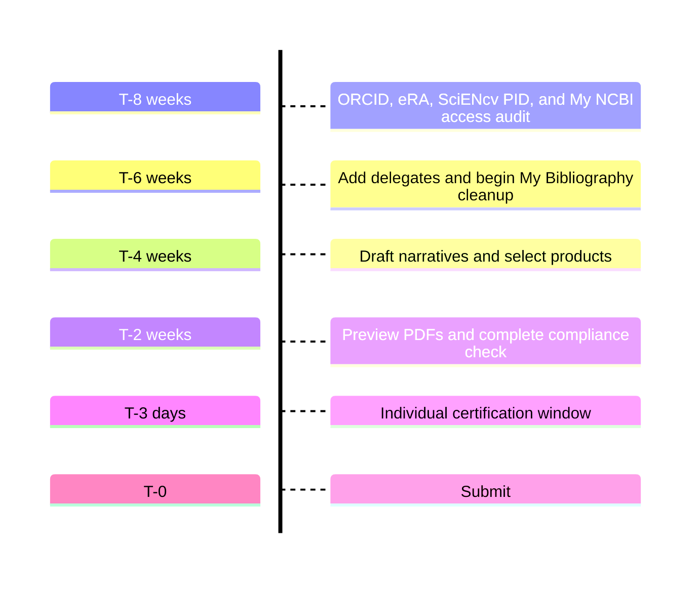

# Submission planning & tracker (admins)

## Recommended milestones

- **T-8 weeks:** ORCID + eRA + SciENcv PID + MyNCBI access audit
- **T-6 weeks:** Delegates added; My Bibliography cleanup begins
- **T-4 weeks:** First draft narratives + product selection
- **T-2 weeks:** SciENcv preview PDFs; role/stage, RST, and compliance check
- **T-3 days:** Individual certification window
- **T-0:** Submit

## Trackers to keep

- ORCID linked in eRA Commons? (Y/N)
- ORCID appears as SciENcv PID and matches eRA Commons? (Y/N)
- Delegate accepted? (Y/N)
- Products selected? (Y/N)
- Biosketch certified? (Y/N)
- CPOS required for this person/stage? If yes, certified? (Y/N)
- Application RST completed within the prior 12 months? (Y/N/N/A)
- Annual RPPR MFTRP Section G.1 statement collected? (Y/N/N/A)

Use the [submission-lifecycle matrix]({{ site.baseurl }}) before assigning documents.
