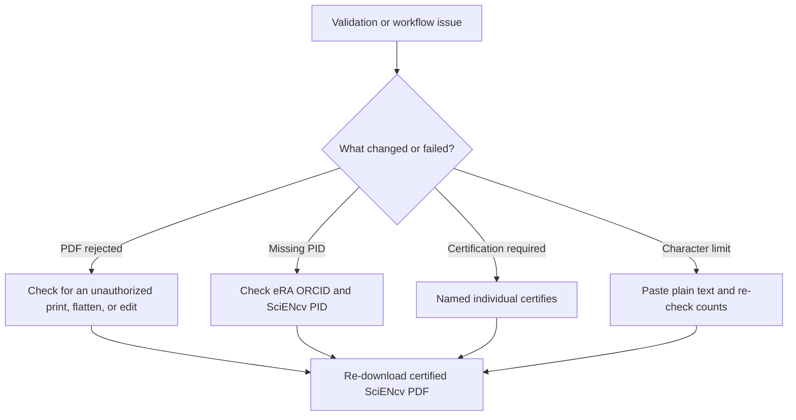

# Troubleshooting

Use these pages to diagnose common SciENcv + eRA validation issues and to answer frequently asked questions.

```mermaid
flowchart TD
    accTitle: Troubleshooting entry point
    accDescr: Troubleshooting starts by identifying whether the issue is a PDF format problem, missing identifier, certification gap, or narrative formatting problem.
    A["Validation or workflow issue"] --> B{"What changed or failed?"}
    B -- "PDF rejected" --> C["Check for an unauthorized print, flatten, or edit"]
    B -- "Missing PID" --> D["Check eRA ORCID and SciENcv PID"]
    B -- "Certification required" --> E["Named individual certifies"]
    B -- "Character limit" --> F["Paste plain text and re-check counts"]
    C --> G["Re-download certified SciENcv PDF"]
    D --> G
    E --> G
    F --> G
```
