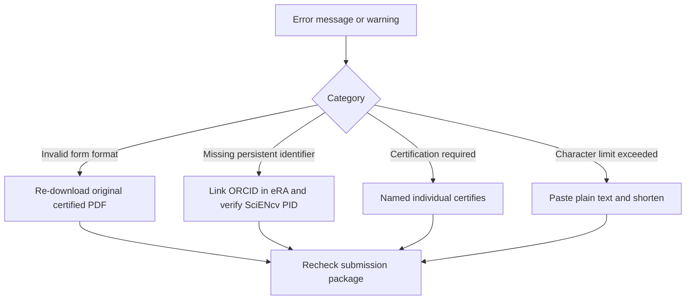

# Common errors (and fixes)

## “Invalid form format” / form rejected

- Cause: PDF was printed/flattened
- Fix: re-download the original certified PDF from SciENcv

## “Missing persistent identifier”

- Cause: ORCID is not linked or the Common Form PID does not match eRA Commons
- Fix: link ORCID in **eRA Commons**, then confirm the same ORCID appears as the **SciENcv PID**. Populate the PID by linking ORCID in MyNCBI/SciENcv, signing in with ORCID, or entering it manually in the Common Form.

## “Certification required”

- Cause: the named individual did not certify
- Fix: the named individual must log in and certify (delegate cannot)

## Character limit exceeded

- Cause: hidden formatting from Word
- Fix: paste as plain text; re-check counts in SciENcv

