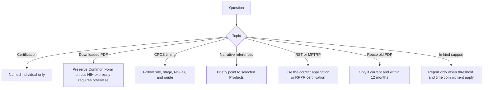

# FAQ

## Can my admin certify for me?

No. Certification must be completed by the individual from their own SciENcv account.

## Can I edit the PDF after I download it?

Not by default. Any edit risks breaking the machine-readable metadata. Preserve each certified SciENcv Common Form unless the NIH Application Guide or NOFO expressly requires a special attachment, such as compiled/flattened participating-faculty biosketches. Flatten required foreign contracts and annual MFTRP statements as **separate** attachments; do not append them to a Common Form.

## Do I always submit CPOS with an NIH application?

No. For many NIH applications, current and pending support is requested later in the process (often during **JIT**) or in **RPPR/Prior Approval** workflows. At application stage, follow the **NOFO** and the **NIH Application Guide**. One important application-stage exception is **mentored career development** applications, which require CPOS for **mentor/co-mentor(s)**, not for the candidate.

## Where do I put citations for my Personal Statement and Contributions?

Do **not** add a full bibliographic references list or hyperlinks in the NIH Supplement narrative boxes. Either narrative may refer parenthetically to any selected Common Form Product. NIH suggests lead author/year or PMID/PMCID.

## Is Research Security Training the same as NIH’s Other Support disclosure training?

No. For applications due on/after **May 25, 2026**, each senior/key person must complete qualifying RST within the 12 months before submission and certify through the biosketch; the AOR provides the institutional certification for covered individuals employed by the applicant organization. NIH’s separate recipient requirement to train senior/key personnel on institutional Other Support disclosure policies became effective **Oct 1, 2025**.

## Where does the annual MFTRP certification go?

For RPPRs submitted on/after **Jan 25, 2026**, upload a separate flattened statement for each senior/key person in RPPR Section G.1, named `MFTRPcert_[Name].pdf`. Do not append it to the biosketch or CPOS PDF. See [Research-security certifications]({{ site.baseurl }}).

## Can I reuse an older certified PDF?

Only if the content is still current **and** the certification/signature date is still within **12 months** of submission. If anything changes, or the certification is too old, generate a fresh PDF from SciENcv and re-certify it. Renaming the file is fine; editing the PDF content is not.

## Do I report institutional core facilities or shared equipment in CPOS?

Usually **no**. Broadly available institutional core facilities and shared equipment belong under **Facilities and Other Resources**, not Other Support / CPOS.

## Do I report an in-kind contribution if there is no associated time commitment?

No. NIH says an in-kind contribution does **not** need to be reported when there is **no associated commitment of the individual’s time**.

